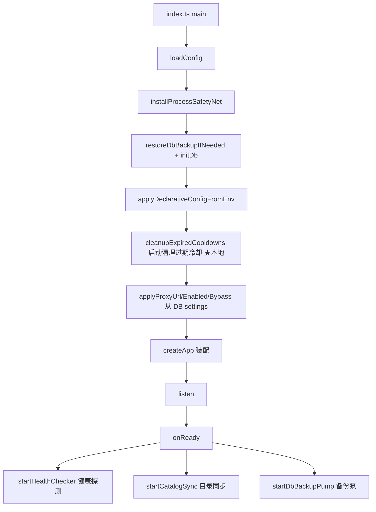
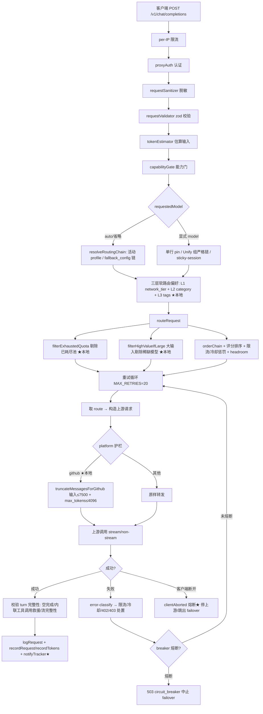

# FreeLLMAPI 代码梳理与技术债盘点（CNB Review）

> **任务**：梳理 `coffcoe/freellmapi`（上游 fork + 长期本地定制）的架构与定制清单，对照上游核实每项定制状态，盘点技术债，产出可落地改进清单。
> **依据**：`CUSTOM-PATCHES.md`（全量台账）+ `server/src` 实际代码逐条核实 + 上游 `tashfeenahmed/freellmapi` 最新 `main`（`29eb340`）只读对照。
> **时间**：2026-08-06 ｜ **范围**：只做分析与文档，未改动任何业务代码。

---

## 0. 结论速览（TL;DR）

| 维度 | 结论 |
|---|---|
| **仓库状态** | 本地 `main` = `f01cdc3`（2026-08-06 快照），**落后上游 ~250+ commit**（上游已到 `29eb340`，含 v0.4.1+ 大量演进） |
| **工作树** | **clean**：台账 §3 的 16 个未提交文件已被 `f01cdc3` 快照提交，不再是"未提交" |
| **🔴 编译断裂** | `app.ts` import 不存在的 `routes/config.ts`；`defaults.ts` import 不存在的 `20260802_000000_quota_guard_columns.ts` → **当前 HEAD 无法通过 `tsc` 编译** |
| **🔴 列依赖断裂** | `proxy.ts` 用 `network_tier`/`tags` 列、`request-log.ts` 用 `client_tag` 列、`router.ts` 用 `is_high_value` 列——这些列**无任何迁移创建**（依赖缺失的 quota_guard 迁移） |
| **台账 §4 文件缺失** | `config.ts`、`free-model-audit.ts`、`quota_guard_columns.ts`、`free-tier-reference.md` 及多数运维脚本在本仓库**不存在**（仅 `restart-freellmapi.ps1` 在） |
| **台账遗漏** | `19e8771`（middleware 链 + proxy-manager + i18n + local-migration，25 文件 / +4984 行）**未被台账记录** |
| **上游已合入** | guardrails（e5024d5）已并入上游；AI Horde、request_hourly、embedding dimensions、modelscope、agnes 等已在上游 |
| **本地仍独有** | github 截断护栏、OpenRouter validateUrl 修复、agnes `.cn`、clientTag/tracker、`filterExhaustedQuota`/`filterHighValueIfLarge`、`NO_LIMIT_COOLDOWN_CAP_MS`、catalog-sync rpd_limit 排除、config 多客户端路由、cline 平台 |

**给业主的一句话**：这份快照（`f01cdc3`）**没有完整复刻本机工作树**——4 个关键源码文件与多数运维脚本在快照时漏掉，导致仓库当前是**编译不过**的状态。技术债优先级第一是**补齐缺失文件**，第二是**追赶上游或冻结上游**，第三才是清理与迁移固化。

---

## 1. 架构梳理

### 1.1 顶层目录职责

```text
freellmapi/
├── server/                 # 核心代理服务（Node + Express + better-sqlite3 + zod）
│   └── src/
│       ├── index.ts        # 启动入口：初始化 DB、启动健康检查/catalog-sync/备份泵
│       ├── app.ts          # Express 应用装配：路由挂载 + /v1 中间件链
│       ├── env.ts          # 环境变量加载
│       ├── routes/         # HTTP 路由（API 面 + 代理面）
│       ├── services/       # 业务逻辑（路由/限流/健康/catalog/模型清单等）
│       ├── providers/      # 上游 LLM 提供商适配器
│       ├── lib/            # 通用库（配置/加密/代理/日志/护栏/工具调用等）
│       ├── middleware/     # /v1 代理中间件链（认证/清洗/校验/归一/估算/能力门）
│       ├── db/             # 数据库初始化 + 迁移框架
│       │   ├── migrate/    # 迁移 runner / defaults / cli
│       │   └── migrations/ # 具体迁移文件
│       ├── scripts/        # 运维脚本（export-catalog / routing-sim / test-all-models）
│       └── docs/           # OpenAPI 规范 + Swagger UI
├── shared/types.ts         # 跨端共享 TS 类型（Platform 联合类型等）
├── client/                 # React 仪表盘 SPA（Vite）
├── desktop/                # Electron 桌面壳
├── restart-freellmapi.ps1  # Windows 重启脚本（台账 §4.7，纯 ASCII+BOM）
└── CUSTOM-PATCHES.md       # 定制台账（权威依据）
```

### 1.2 启动流程（`index.ts` → `app.ts`）



> ★ = 本地定制（`f01cdc3` 中 `index.ts` 的 `cleanupExpiredCooldowns`：启动时主动清过期冷却，防"路由耗尽死锁"——上游没有）。

### 1.3 `/v1` 中间件链（`app.ts` 装配，本地独有）

本地 `app.ts` 用 feature-flag 构建了一条 6 段中间件链（`19e8771` 引入，上游未采用此结构，改用 `clientContextMiddleware` + 内联校验）：

```text
/v1 请求
  ├─ createProxyRateLimiter        # 每 IP 限流（PROXY_RATE_LIMIT_RPM）
  ├─ proxyAuth                     # unified API key 认证（HMAC 恒定时间比较 ★安全修复）
  ├─ requestSanitizer              # 敏感信息脱敏（Bearer/API key/token）
  ├─ requestValidator              # zod 校验（chat/embeddings/responses）
  ├─ messageNormalizer             # 消息结构归一化
  ├─ tokenEstimator                # 输入 token 估算
  ├─ capabilityGate                # 能力门（vision/tools 模型存在性检查）
  └─ proxyRouter / responsesRouter # 业务路由
```

每段可用 `ENABLE_*` 或 `DISABLE_ALL_MIDDLEWARE=true` 独立开关。

### 1.4 路由挂载全景

| 前缀 | 路由 | 说明 |
|---|---|---|
| `/api/auth` | authRouter | 仪表盘登录/setup（免登录） |
| `/api/keys` `/api/models` `/api/profiles` `/api/fallback` `/api/embeddings` `/api/media` `/api/analytics` `/api/health` `/api/settings` `/api/premium` | 各自 Router | 管理 API，全部 `requireAuth` |
| `/api/config` + `/v1/config` | configRouter ★缺失 | 多客户端接入模板（openai/claude/cursor/continue/codex/gemini_cli） |
| `/v1` | anthropicRouter | Anthropic 兼容（/v1/messages、/count_tokens），先于 OpenAI 路由做内容协商 |
| `/v1` | proxyRouter | OpenAI 兼容主代理：`/models`、`/chat/completions`、`/completions`、`/embeddings`、`/images/generations`、`/audio/speech` |
| `/v1` | responsesRouter | OpenAI Responses API shim（Codex） |
| `/v1/openapi.json` `/v1/docs` | 静态 | OpenAPI + Swagger UI |
| `/api/ping` | — | 健康探针 |

### 1.5 一次 `/v1/chat/completions` 的完整链路



**关键节点说明**：

1. **路由选择**：`resolveRoutingChain` 支持 `auto` / `auto:策略` / 显式模型；活动 profile（`active_profile_id`）优先，否则回退 `fallback_config` 全局链。
2. **故障转移**：重试循环最多 20 次（`MAX_RETRIES`），每次 `routeRequest` 跳过已失败 `(model,key)`，遇 429/冷却/402/403 精准处置；护栏层 `newBreaker` 在**连续上游失败超限**时提前熔断返回 503，避免 38.8s 串行重试（上游已合入此逻辑）。
3. **护栏熔断**（`lib/guardrails.ts`，本地提交 `e5024d5`）：`request_max_tokens_budget`（单请求 token 成本天花板，413 预拒 + 流式中途早停）与 `max_consecutive_upstream_fails`（连续失败断路器），运行时可经 settings 表调整。
4. **本地独有护栏**：github 输入截断 + 输出封顶；`clientAborted` 客户端断开即熔断；`filterExhaustedQuota` 按 `(platform,key_id)` 剔除 `provider_quota_state.remaining_value=0` 且未重置的耗尽池。
5. **可观测**：`logRequest` 写原始行 + `request_hourly` 小时聚合 + lifetime counters；本地额外 `client_tag` 溯源 + `notifyTracker` 非阻塞 POST 到 3003 端口的 Flask tracker。

### 1.6 分层调用关系（services ↔ lib ↔ providers ↔ db）

```text
routes/proxy.ts ──> services/router.ts ──> services/scoring.ts（评分/护栏系数）
                │                        └─> services/provider-quota.ts（额度观测）
                ├──> services/ratelimit.ts（RPM/RPD/TPD + 冷却 + 429 处置）
                ├──> services/model-listing.ts（/v1/models 数据）
                ├──> services/fusion.ts（多模型融合）
                ├──> services/context-handoff.ts（会话上下文交接）
                ├──> services/embeddings.ts / media.ts（embedding/图像/音频）
                ├──> lib/guardrails.ts（预算 + 熔断）
                ├──> lib/request-log.ts（请求审计 + 聚合 + tracker★）
                └──> providers/index.ts（平台注册表）
                        ├── openai-compat.ts（通用 OpenAI 兼容）
                        ├── aihorde.ts / cloudflare.ts / cohere.ts / google.ts / base.ts
                        └── [缺失] modelscope.ts（上游有、本地无）
```

---

## 2. 定制清单核实（对照上游逐条）

> 标注约定：✅ 仍有效 ｜ ⚠️ 可能冗余/上游已合入 ｜ 🔴 仍有风险
> 上游对照基准：`/tmp/freellmapi-upstream`（`tashfeenahmed/freellmapi@29eb340`）

### 2.1 已提交自定义 commit（台账 §2）

| commit | 内容 | 核实 | 状态 |
|---|---|---|---|
| `e5024d5` | guardrails 护栏层（预算+熔断） | 上游 `lib/guardrails.ts` 明确 "Ported from @coffcoe's fork (e5024d53)" | ⚠️ **上游已合入**（本地仍可用，但继续维护需留意上游演进） |
| `f4cd7b4` | catalog 控制 + 持久化备份 | 代码存在（catalog-sync + db-backup） | ✅ |
| `bc07927` | router penalty inspector | `services/penalty-inspector.ts` 存在 | ✅ |
| `1fdcae4` | AI Horde provider | 上游已有 `providers/aihorde.ts` | ⚠️ 上游已合入 |
| `441dc92` | 密钥页管理自定义模型 | `routes/keys.ts` 相关逻辑 | ✅ |
| `5918efc` | provider key 导入流 | 代码存在 | ✅ |
| `8c9cf94` | NULL-limit provider 429 启发式 | 上游 ratelimit 已有类似逻辑 | ⚠️ 上游已合入（本地在此基础上强化） |
| `d1943a8` | 运行时能力守卫 + Config 集中 | 代码存在 | ✅ |
| `a8cdc3d` | embedding MRL 维度参数 | 上游已有 | ⚠️ 上游已合入 |
| `055c166` | request_hourly 聚合 | 上游已有 `20260628_120000_request_aggregates.ts` | ⚠️ 上游已合入 |
| `4133cc4` | google x-* schema 剥离 | 代码存在 | ✅ |
| `a3c8838` | 400 耗尽语义 | 代码存在 | ✅ |
| `c2f1dee`/`fa0fe5b` | UI/显示修正 | client 侧 | ✅ |
| `1971774` | merge upstream | 合入点 | — |

> **台账遗漏（重要）**：`19e8771`（2026-06-17，`feat: middleware chain, proxy manager, i18n, local migration scripts`）——25 文件 / +4984 行，引入 **middleware 链、proxy-manager、i18n、local-migration/ 目录**。**台账 §2 未记录此 commit**，建议补录。

### 2.2 未提交改动（台账 §3）→ 实际已提交

台账记录 16 个 tracked `M` 文件，**但工作树当前是 clean 的**——全部已被 `f01cdc3`（`chore: snapshot local customizations for CNB NPC review`）提交。逐条核实：

| 文件 | 定制点 | 代码核实 | 状态 |
|---|---|---|---|
| `shared/types.ts` | `cline`/`modelscope` 平台类型 | L94-100 存在 | ✅（上游有 modelscope 无 cline） |
| `server/package.json` | build 拷贝 docs | `tsc && cp -r src/docs dist/docs` | ✅ |
| `server/src/db/migrate/defaults.ts` | 注册 quota_guard 迁移 | L28/L38 引用，**但迁移文件缺失** | 🔴 |
| `server/src/lib/request-log.ts` | `clientTag` + `notifyTracker` | L59/L65/L96-100/L113-119 存在（上游无） | ✅ |
| `server/src/middleware/proxyAuth.ts` | HMAC 恒定时间比较 | L61-69 存在（本地独有） | ✅ |
| `server/src/providers/index.ts` | OpenRouter `/api/v1/key`、agnes `.cn`、cline/modelscope 注册 | L63/L206/L290/L299 存在（上游无前两者） | ✅ |
| `server/src/routes/models.ts` + `services/model-listing.ts` | 列表字段扩充 | `category/lastVerifiedAt/probeStatus/rateLimit/tier/requiresCreditCard` 均在 | ✅ |
| `server/src/services/catalog-sync.ts` | UPDATE 排除 `rpd_limit` | L177-191 存在（上游无） | ✅ |
| `server/src/services/ratelimit.ts` | `NO_LIMIT_COOLDOWN_CAP_MS=10min` | L310/L414 存在（上游无） | ✅ |
| `server/src/services/router.ts` | `filterExhaustedQuota` + `filterHighValueIfLarge` | L439/L893/L888/L917 存在（上游无） | ✅ |
| `server/src/routes/proxy.ts` | 场景路由 + github 截断 + 熔断 + clientTag | 全部存在（上游无） | ✅ |
| `server/src/__tests__/services/ratelimit.test.ts` | 测试更新 | 存在 | ✅ |
| `server/src/app.ts` | 挂载 configRouter | L108-109 挂载，**但 config.ts 缺失** | 🔴 |
| `server/src/index.ts` | 启动清理过期冷却 | 存在（上游无） | ✅ |
| `server/src/services/health.ts` | keyless 健康检查适配 | 存在 | ✅ |
| `README.md`/`package-lock.json` | 文档/依赖 | 存在 | ✅ |

### 2.3 未跟踪自定义文件（台账 §4）→ 实际状态

| 台账条目 | 预期文件 | 本仓库实际 | 状态 |
|---|---|---|---|
| §4.1 `20260701_000001_add_category_to_models.ts` | 迁移 | ✅ 存在（已注册） | ✅ |
| §4.2 `20260701_000002_add_probe_fields.ts` | 迁移 | ✅ 存在（已注册） | ✅ |
| §4.3 `20260802_000000_quota_guard_columns.ts` | 迁移（is_high_value/client_tag） | ❌ **缺失** | 🔴 |
| §4.4 `routes/config.ts` | 多客户端接入模板 | ❌ **缺失** | 🔴 |
| §4.5 `scripts/free-model-audit.ts` | 模型探测/审计 | ❌ **缺失** | 🔴 |
| §4.6 `docs/free-tier-reference.md` | 免费额度参考 | ❌ **缺失** | 🔴 |
| §4.7 `restart-freellmapi.ps1` | 重启脚本 | ✅ 存在（已提交） | ✅ |
| §4.7 `start_local.sh` / `start-freellmapi-manual.cmd` / `vault_inject.js` / `ensure-main-model.py` / `cleanup_clusterB.py` / `agnes-provider.json` | 运维脚本 | ❌ **全部缺失**（未进仓库） | 🔴/⚠️ |
| §4.8 调试残留（`.env.bak-*`、`_tmp_query*.cjs`、`index.ts.bak-agnes`、`dist.bak-*`） | — | ✅ 本仓库无（未提交、好） | ✅ |

### 2.4 DB 自定义数据（台账 §5）

| 数据 | 台账 | 代码支撑 | 全新 clone 可复现? |
|---|---|---|---|
| `rpd_limit` 上限（14 平台） | ✅ | 代码侧有 `PROVIDER_DAILY_REQUEST_CAP_*` env（catalog-immune）+ ratelimit 消费 `rpd_limit`；但**设值本身只在运行库** | 🔴 不可复现 |
| `is_high_value=1`（17 行） | ✅ | `router.ts` 消费；但**列由缺失迁移创建** | 🔴 列+数据都不可复现 |
| github embedding 禁用 | ⚠️ | 仅在运行库 UPDATE，代码无此数据 | 🔴 不可复现 |
| `glm-4-flash` 固化 | ⚠️ | `ensure-main-model.py` **缺失**；但 catalog-sync 删除保护（`key_id IS NULL AND size_label NOT IN ('User','Custom')`）在代码中 | 🔴 固化脚本缺失 |
| `probe_logs` 数据 | ✅ | 迁移创建表 + `free-model-audit.ts` 写（**脚本缺失**） | 🔴 |

### 2.5 问题修复类（台账 §6）

| 条目 | 根因 | 处置 | 代码核实 | 状态 |
|---|---|---|---|---|
| §6.1 catalog-sync 误删 glm-4-flash | key_id 空被当"上游下架" | ensure-main-model.py + 删除豁免 | 删除逻辑含 `key_id IS NULL AND size_label NOT IN ('User','Custom')` 豁免 | ✅ 已缓解（脚本缺失需补） |
| §6.2 catalog 覆盖 rpd_limit | UPDATE 带 rpd_limit=null | UPDATE 排除 rpd_limit | L177-191 | ✅ 已修 |
| §6.3 OpenRouter 健康虚高 | /models 公开端点 | validateUrl=/api/v1/key | L63 | ✅ 已修 |
| §6.4 无上限 24h 冷却级联 | 429 抖动 → 24h 死亡冷却 | NO_LIMIT_COOLDOWN_CAP_MS=10min | L310/L414 | ✅ 已修 |
| §6.5 proxyAuth 时序泄露 | 长度分支时序泄露 | HMAC 固定长度摘要 | L61-69 | ✅ 已修 |
| §6.6 github 413/400 | 输入/输出硬限 | 截断 + 封顶 | L503-518/L1653 | ✅ 已缓解 |
| §6.7 迁移幂等陷阱 | baseline 已 applied 加列无效 | 独立迁移 + PRAGMA 守卫 | 迁移文件含 PRAGMA | ✅ 已修 |
| §6.8 未注册迁移 | 20260701_* 未注册 | 注册进 DEFAULT_MIGRATIONS | 已注册 | ✅ |
| §6.9 重启脚本解析失败 | UTF-8 无 BOM 被当 GBK | 纯 ASCII+BOM | 脚本存在 | ✅ |

---

## 3. 技术债与风险盘点（详细）

### 3.1 🔴 P0-A：快照提交缺失关键文件 → 仓库编译断裂

`f01cdc3` 快照只收录了 16 个 tracked 修改文件，**未收录 4 个源码级 untracked 文件**，且这 4 个被其他已提交文件引用：

```text
server/src/app.ts:15              import { configRouter } from './routes/config.js'   → 文件缺失
server/src/db/migrate/defaults.ts:9  import * as quotaGuardColumns from '../migrations/20260802_000000_quota_guard_columns.js' → 文件缺失
```

**连带影响**：
- `tsc` 直接报 `Cannot find module`，`npm run build` 失败。
- `is_high_value` / `client_tag` 列**没有任何迁移创建**（quota_guard 迁移承载），一旦删库重建，`router.ts`/`request-log.ts`/`proxy.ts` 运行时报 `no such column`。
- `proxy.ts` 的 `SELECT id, category, network_tier, tags FROM models` 中 `network_tier`/`tags` 列**全仓库无创建来源**（同样应在 quota_guard 或相关迁移中）。

**建议**：尽快从本机补交 `config.ts`、`free-model-audit.ts`、`quota_guard_columns.ts`、`free-tier-reference.md` 及运维脚本；若本机也不可恢复，则**从 `app.ts`/`defaults.ts` 移除引用并回退相关功能**（决策需业主拍板）。

### 3.2 🔴 P0-B：落后上游 ~250 commit，存在版本分叉

- 本地 `main`（`f01cdc3`）↔ 上游 `29eb340`（2026-08-06 仍活跃）。
- 上游新增 **14 个迁移**（`20260706~20260805`：request_client_info、custom_model_tool_support、profile_chain_backfill、key_health_error、cooldown_probe_provenance、request_attempts、model_source_provenance、media_model_meta、request_served_model、attempt_error_summary、agent_compatibility、tombstone_provenance、custom_endpoint_host_labels、key_model_scope、client_profiles 等）。
- 上游新增大量 lib（`client-context`、`fallback-loop`、`gemini-wire`、`wake-detect`、`env-drift`、`log-redaction`、`setup-code`、`model-scope`、`attempt-trace` 等）与 routes（`client-profiles`、`cache`、`compression`、`docs`、`update`、`mcp`、`ollama`、`gemini`、`status`、`url-tokens` 等）。
- 上游 app.ts 结构已重写（`adminRateLimiter`、`/v1/t/:token` url token 路由、`providersRouter`、`docsRouter` 等），**本地 middleware 链式结构在上游已被抛弃**（上游用 `clientContextMiddleware` + 各路由内联校验）。

**两条路线**：
- **A. 追赶上游**：`git fetch upstream && merge`，但会与本地大量定制冲突，且本地独有的 middleware 链/护栏需重新适配上游新结构——**工程量大**。
- **B. 冻结上游**：明确"本地为定制分支，不再追上游"，只在关键安全/稳定性修复上 cherry-pick——**省力但长期失血**（上游 429/冷却、catalog、health 等改进都拿不到）。
- **折中建议**：本地已合入上游的定制（guardrails/AI Horde/request_hourly 等）可放心跟随上游；本地独有逻辑（github 截断、OpenRouter 校验、agnes .cn、clientTag、quota 剔除、10min 冷却封顶）需在上游合并后**逐项重放并跑漂移检测**（§7 清单）。

### 3.3 🔴 P0-C：DB 自定义数据仅运行库有，全新 clone 不可复现

台账 §5 明确：`rpd_limit` 14 平台、`is_high_value` 17 行、github embedding 禁用、glm-4-flash 固化均**只在运行库**。

- 新增 clone → 无这些数据 → 路由缺稀缺模型保护、github embedding 照常失败、catalog-sync 可能误删主模型。
- **建议**：把这些默认值写进迁移 `up()`（如 `20260802_000001_local_defaults`），用条件 UPDATE（`WHERE` 判定幂等）固化；`is_high_value` 列先恢复 quota_guard 迁移再插数据。

### 3.4 ⚠️ P1-A：`19e8771` 大提交未入台账

- 25 文件 / +4984 行的 middleware 链 + proxy-manager + i18n + local-migration 提交**未被 CUSTOM-PATCHES.md 记录**。
- local-migration/ 目录（`db.index.ts` 1836 行、`keys.ts`、`providers.index.ts`、`types.ts`）是本地一次性迁移脚本，建议确认是否仍需保留；若仅一次性使用可移出仓库。

### 3.5 ⚠️ P1-B：调试残留

台账 §4.8 列出的残留（`.env.bak-*`、`_tmp_query*.cjs`、`index.ts.bak-agnes`、`dist.bak-*`）**本仓库均不存在**（未进入快照）——✅ 好。但需确认**本机**仍按台账清理，避免未来误提交。

### 3.6 ⚠️ P1-C：catalog-sync 漂移风险（台账 §7 依据）

- catalog-sync 每次同步会按上游 catalog 覆盖 `display_name/ranks/limits/context_window/enabled` 等（本地已排除 rpd_limit/raw_capabilities/capability_sources）。
- 若追上游后上游改了 catalog-sync 结构，本地排除逻辑可能被覆盖 → rpd_limit 再被清。
- **建议**：把 §7 漂移检测做成 CI 步骤（`scripts/drift-check.sh`），merge 后自动 grep 标记。

### 3.7 ⚠️ P1-D：`network_tier`/`tags` 列无出处

- `proxy.ts` 三层软路由读取 `models.network_tier` / `models.tags` 列，但**本地迁移体系没有任何迁移创建这两列**（baseline 无，20260701_* 无，quota_guard 缺失）。
- 当前运行库可能有（历史手工 ALTER），但全新 clone 必然 `no such column`。
- **建议**：并入 quota_guard 恢复迁移一并解决。

### 3.8 ⚠️ P1-E：本地 provider 与上游 provider 分化

| 本地独有 | 上游独有 |
|---|---|
| `cline`（1M 上下文免费） | `aion`、`nara`、`navy`、`requesty`、`sealion` |
| modelscope 用通用 OpenAICompat 注册（上游有专门 `modelscope.ts`） | 上游专门 provider 文件 |

- 本地 `modelscope` 仅注册在 `providers/index.ts`（`platform: 'modelscope'`），**没有**上游的 `providers/modelscope.ts` 专用适配（含"calls only work 实测需专门处理"的注释）。**建议**：合并上游时引入专用适配。

### 3.9 ⚠️ P1-F：依赖缺失

- 本地仓库无 `node_modules`、无 `dist`（本环境未构建）。恢复缺失文件后需 `npm ci` + `npm run build` 验证。
- `package.json` build 脚本已含 docs 拷贝（定制保留）。

---

## 4. 改进建议（优先级清单）

### P0（必须，先止血）

| # | 事项 | 动作 | 验收 |
|---|---|---|---|
| P0-1 | **恢复缺失源码文件** | 从本机补交 `config.ts`、`free-model-audit.ts`、`quota_guard_columns.ts`（或明确废弃并移除引用）；同步补 `free-tier-reference.md` | `tsc --noEmit` 通过 |
| P0-2 | **补齐 `network_tier`/`tags`/`client_tag`/`is_high_value` 列创建** | 新增迁移（PRAGMA 幂等守卫） | 全新 clone 跑迁移后查询无 `no such column` |
| P0-3 | **决策上游策略** | 业主明确"追上游"或"冻结"，并写入 README/CUSTOM-PATCHES §0 | 有结论 + 文档 |
| P0-4 | **DB 默认值固化进迁移** | 写 `rpd_limit`/`is_high_value`/github embedding 禁用/glm-4-flash 兜底到迁移 `up()` | 全新 clone 复现台账 §5 数据 |

### P1（重要，次优）

| # | 事项 | 动作 |
|---|---|---|
| P1-1 | 提交未提交改动到独立分支 | 按台账 §0 推荐：`custom` 分支承载定制，`main` 仅 merge upstream + merge custom；当前 `f01cdc3` 快照应回退重做（因缺失文件） |
| P1-2 | 清理调试残留 | 本机执行台账 §4.8 清理；`.gitignore` 已覆盖 *.bak 等，确认无遗漏 |
| P1-3 | 漂移检测自动化 | 把 §7 grep 清单做成 `scripts/drift-check.sh`，接 CI 或 git hook |
| P1-4 | 补录 `19e8771` 到台账 | CUSTOM-PATCHES.md 新增 §2 条目 |
| P1-5 | 引入上游 modelscope 专用适配 | 合并上游时用 `providers/modelscope.ts` 替换通用注册 |
| P1-6 | 核对 `config.ts` 需求 | 若确需多客户端接入模板则恢复；否则从 app.ts 移除挂载 |

### P2（可选，打磨）

| # | 事项 | 动作 |
|---|---|---|
| P2-1 | 评估 middleware 链 vs 上游新结构 | 若追上游，评估把 proxyAuth/sanitizer/validator 迁到上游的 `clientContextMiddleware` 模式 |
| P2-2 | 评估 `local-migration/` 目录去留 | 一次性脚本可移出仓库或归档 |
| P2-3 | 补充 `filterExhaustedQuota`/`filterHighValueIfLarge` 的单元测试 | 现有 `router.test.ts` 未覆盖本地新增函数（`routing-exhaustion.test.ts` 覆盖部分） |
| P2-4 | `free-model-audit.ts` 恢复后接入 CI 定时探测 | 让 `probe_logs` 数据持续产生 |

---

## 5. 护栏与合规说明

- ✅ 本次未读取/修改 `.env`、任何 `*.db`、`server/data/`（本环境也不存在这些文件）。
- ✅ 未 push 到 `origin`(github) 或 `upstream`；上游仅 `/tmp/freellmapi-upstream` 只读 clone 参考。
- ✅ 未修改任何业务代码；本文档为纯分析产出。
- ⚠️ 发现的编译断裂（P0-1/P0-2）如需修复，应单独开 PR 并写清动机与影响范围，**不自动 merge**。

---

## 附录 A：漂移检测清单（台账 §7 全量重跑结果）

| 标记 | 文件 | 结果 |
|---|---|---|
| `QUOTA_GUARD_COLUMNS` | `server/src/db/migrate/defaults.ts` | ✅ 存在（L28/L38） |
| `filterExhaustedQuota`/`filterHighValueIfLarge` | `server/src/services/router.ts` | ✅ 存在 |
| `clientAborted`/`truncateMessagesForGithub` | `server/src/routes/proxy.ts` | ✅ 存在 |
| `rpd_limit 治本` | `server/src/services/catalog-sync.ts` | ✅ 存在 |
| `NO_LIMIT_COOLDOWN_CAP_MS` | `server/src/services/ratelimit.ts` | ✅ 存在 |
| `createHmac` | `server/src/middleware/proxyAuth.ts` | ✅ 存在 |
| `api/v1/key`/`agnes-ai.cn` | `server/src/providers/index.ts` | ✅ 存在 |
| `notifyTracker`/`clientTag` | `server/src/lib/request-log.ts` | ✅ 存在 |
| `CLIENT_TEMPLATES` | `server/src/routes/config.ts` | 🔴 **文件缺失** |
| `modelscope` | `shared/types.ts` | ✅ 存在 |

> 结论：9/10 标记存活；唯一失败项即缺失的 `config.ts`（印证 P0-1）。

## 附录 B：上游对照明细（本地 ↔ 上游关键差异）

| 维度 | 本地（f01cdc3） | 上游（29eb340） |
|---|---|---|
| 迁移数 | 7 | 21 |
| `server/src` 文件 | 152 | ~340 |
| provider 平台 | 23（含 cline） | 25（含 aion/nara/navy/requesty/sealion） |
| middleware | 10（本地链式独有） | 3（errorHandler/rateLimit/requireAuth） |
| app.ts 结构 | 手动 feature-flag 链 | adminRateLimiter + url-token + clientContext 重写 |
| 独有定制 | github 截断/OpenRouter 校验/agnes .cn/clientTag/10min 封顶/quota 剔除/config 路由 | wake-detect/log-redaction/env-drift/setup-code/mcp/ollama 路由等 |

---

*文档由 CodeBuddy 基于 `CUSTOM-PATCHES.md` 与仓库实际代码逐条核实产出；若与本机工作树有出入（如本机存在缺失文件），以本机为准并请同步回仓库。*
